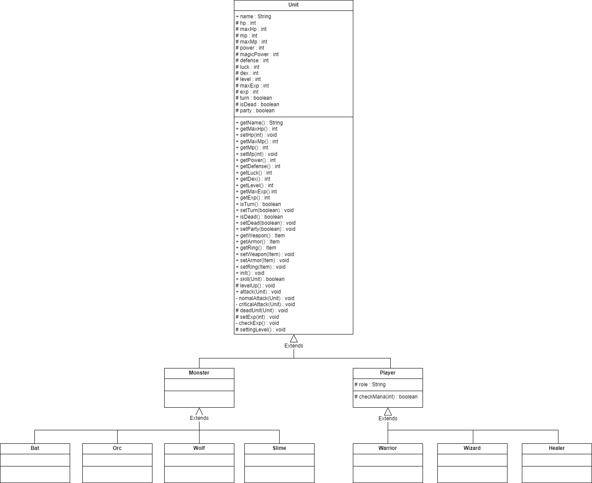

# PolyGame

## 개요
* 길드를 꾸려 던전을 공략해나가는 게임이다.

## 게임내용
* 던전
  * 던전은 10 x 10에 사이즈로 된 맵으로 이루어져 있으며
  * 랜덤 인카운터로 적들을 만날수있다.
  * 던전을 내려가는 출구는 매번 랜덤한 위치에 자리잡고 있고
  * 출구를 찾을시 로비로 돌아와 마을에서 길드와 상점에서 길드를 정비할수 있다.

* 길드
  * 파티원편성
    * 던전을 공략할 길드원 3명을 선택할수 있다.
  * 길드원모집
    * 던전을 공략할 길드원을 구할수있다. 가격별 랜덤시스템으로 브론즈/실버/골드 등급의 길드원을 영입할수있다.
  * 길드추방
    * 필요없는 길드원을 추방하고 소량의 돈을 회수가능
  * 인벤토리
    * 현재 가지고 있는 아이템을 확인 할수있다.
  * 파티원 장비
    * 길드원들의 장비를 착용/착용해제 할수있다.
  * 저장
    * 게임의 진행도 및 길드원 아이템 저장가능
  * 불러오기
    * 저장된 게임을 불러올 수 있다.
  
* 상점
  * 구매
    * 기본적인 틀로 무기/방어구/반지가 있으며 각각 공격력/방어력/행운을 올려준다.
  * 판매
    * 인벤토리에 가지고 있는 아이템을 팔 수 있다.

## UML

### Unit

### Item

## 영상
던전 영상

https://github.com/dlstjs7617/polyGame/assets/119823004/15aabdc0-7625-446d-9794-9f5c92721fcc

상점및 길드영상

https://github.com/dlstjs7617/polyGame/assets/119823004/ad236223-3366-444e-912c-20fa9930b1f5

    
